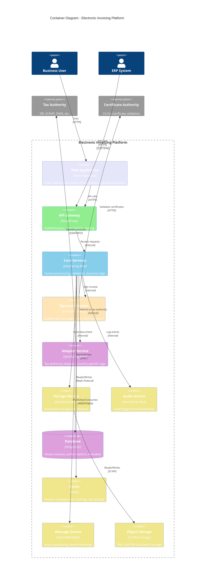

# C4 Container Diagram

> **Icarus Nova** | Container-level architecture showing the major components and their interactions.

## Overview

This C4 Container diagram shows the major containers (applications, data stores, file systems) that make up the Electronic Invoicing Platform and how they interact.

## Container Diagram

## Containers

### Web Application

**Technology**: React/TypeScript, modern web framework

**Responsibilities:**
- User interface for invoice management
- Invoice creation and editing
- Status monitoring
- Report generation
- Administration interface

**Key Features:**
- Responsive design
- Real-time updates
- Multi-language support
- Accessibility

### API Gateway

**Technology**: Kong, Envoy, or similar

**Responsibilities:**
- Request routing
- Authentication and authorization
- Rate limiting
- Request/response transformation
- API versioning

**Key Features:**
- OAuth 2.0 / OpenID Connect
- Rate limiting
- Request logging
- SSL/TLS termination

### Core Services

**Technology**: Java/Spring Boot, microservices architecture

**Responsibilities:**
- Invoice creation and validation
- Business logic processing
- Invoice lifecycle management
- XML generation
- Workflow orchestration

**Key Services:**
- **Invoice Service**: Invoice CRUD operations
- **Validation Service**: Business and regulatory validation
- **Workflow Service**: Invoice lifecycle management
- **Notification Service**: User notifications

### Signature Service

**Technology**: Java/Spring Boot

**Responsibilities:**
- Digital signature application
- Signature validation
- Certificate management
- Certificate rotation
- Signature timestamping

**Key Features:**
- XAdES signature support
- PKCS#7 signature support
- Certificate validation
- HSM integration

### Adapter Service

**Technology**: Java/Spring Boot

**Responsibilities:**
- Tax authority integration
- Country-specific adapters
- Invoice submission
- Authorization handling
- Error translation

**Key Features:**
- Pluggable adapters
- Country-specific logic
- Retry mechanisms
- Error handling

### Storage Service

**Technology**: Java/Spring Boot

**Responsibilities:**
- Document storage management
- Document retrieval
- Document versioning
- Storage lifecycle management

**Key Features:**
- Immutable storage
- Version control
- Legal retention
- Secure storage

### Audit Service

**Technology**: Java/Spring Boot

**Responsibilities:**
- Audit event logging
- Audit trail management
- Compliance reporting
- Traceability

**Key Features:**
- Immutable logs
- Comprehensive logging
- Search capabilities
- Export functionality

### Database

**Technology**: PostgreSQL

**Responsibilities:**
- Store invoice metadata
- Store authorization information
- Store organization data
- Store audit events

**Key Features:**
- ACID transactions
- Encryption at rest
- Backup and replication
- Query optimization

### Cache

**Technology**: Redis

**Responsibilities:**
- Session storage
- Rate limiting counters
- Frequently accessed data
- Temporary data storage

**Key Features:**
- High performance
- Persistence options
- Clustering support
- TTL management

### Message Queue

**Technology**: RabbitMQ or Apache Kafka

**Responsibilities:**
- Async processing
- Event streaming
- Decouple services
- Batch processing

**Key Features:**
- Reliable delivery
- Scalability
- Message persistence
- Consumer groups

### Object Storage

**Technology**: S3, Azure Blob Storage, or similar

**Responsibilities:**
- XML document storage
- PDF document storage
- Document archival
- Backup storage

**Key Features:**
- Scalability
- Durability
- Encryption
- Lifecycle policies

## Container Interactions

### Invoice Creation Flow

1. **User/ERP** → **API Gateway**: Submit invoice
2. **API Gateway** → **Core Services**: Route request
3. **Core Services** → **Validation Service**: Validate invoice
4. **Core Services** → **Signature Service**: Sign invoice
5. **Core Services** → **Storage Service**: Store document
6. **Core Services** → **Adapter Service**: Submit to tax authority
7. **Adapter Service** → **Tax Authority**: Submit invoice
8. **Core Services** → **Audit Service**: Log events
9. **Core Services** → **Database**: Store metadata

### Authorization Flow

1. **Tax Authority** → **Adapter Service**: Authorization response
2. **Adapter Service** → **Core Services**: Process authorization
3. **Core Services** → **Database**: Update invoice status
4. **Core Services** → **Message Queue**: Publish event
5. **Core Services** → **Notification Service**: Notify user
6. **Core Services** → **Audit Service**: Log authorization

## Related Documents

- [C4 System Context](./c4-system-context.md)
- [Invoice Flow](./invoice-flow.md)
- [Core Architecture](../core/README.md)

---

**Last Updated:** 2024  
**Maintained by:** Icarus Nova Architecture Team  
**Version:** 1.0
