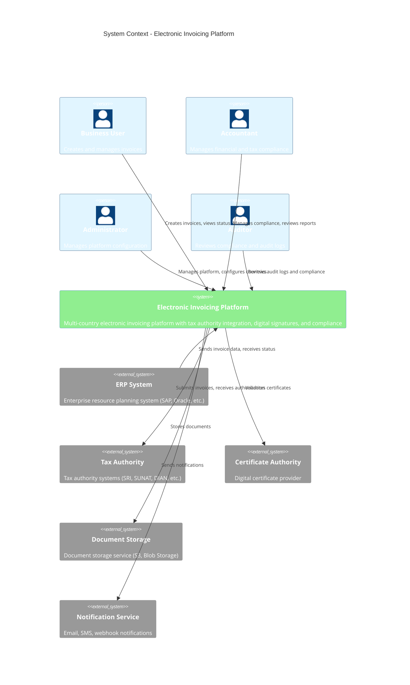

# C4 System Context Diagram

> **Icarus Nova** | High-level system context showing the electronic invoicing platform and its interactions.

## Overview

This C4 System Context diagram shows the Electronic Invoicing Platform at the highest level of abstraction, identifying the system's users, external dependencies, and key interactions.

## System Context Diagram

## Actors

### Primary Users

#### Business User
- **Role**: Invoice creator and manager
- **Interactions**:
  - Creates invoices
  - Views invoice status
  - Manages invoice lifecycle
  - Downloads invoices

#### Accountant
- **Role**: Financial and tax compliance
- **Interactions**:
  - Reviews invoices
  - Manages compliance
  - Generates reports
  - Handles tax authority issues

#### Administrator
- **Role**: Platform management
- **Interactions**:
  - Configures countries
  - Manages certificates
  - Configures tax authority integrations
  - Manages users and permissions

#### Auditor
- **Role**: Compliance verification
- **Interactions**:
  - Reviews audit logs
  - Verifies compliance
  - Generates compliance reports
  - Validates operations

## External Systems

### ERP System
- **Purpose**: Business system integration
- **Examples**: 
  - SAP
  - Oracle ERP
  - Microsoft Dynamics
  - Custom ERP systems
- **Integration**: 
  - Invoice data submission
  - Status updates
  - Webhook callbacks
  - API integration

### Tax Authority
- **Purpose**: Regulatory compliance
- **Examples**:
  - SRI (Ecuador)
  - SUNAT (Peru)
  - DIAN (Colombia)
  - SAT (Mexico)
  - SII (Chile)
- **Integration**:
  - Invoice submission
  - Authorization
  - Status checking
  - Certificate validation

### Certificate Authority
- **Purpose**: Digital certificate validation
- **Examples**:
  - Commercial CAs
  - Government CAs
  - Country-specific CAs
- **Integration**:
  - Certificate validation
  - Certificate revocation checking
  - Certificate chain validation

### Document Storage
- **Purpose**: Document storage and archival
- **Examples**:
  - AWS S3
  - Azure Blob Storage
  - Google Cloud Storage
- **Integration**:
  - Document storage
  - Document retrieval
  - Document archival

### Notification Service
- **Purpose**: User communications
- **Examples**:
  - Email services
  - SMS gateways
  - Webhook services
- **Integration**:
  - Authorization notifications
  - Error notifications
  - Status updates
  - Webhook callbacks

## System Responsibilities

### Electronic Invoicing Platform

**Core Responsibilities:**
1. **Invoice Management**
   - Invoice creation and validation
   - XML generation
   - Digital signature application
   - Invoice lifecycle management

2. **Tax Authority Integration**
   - Multi-country support
   - Tax authority adapters
   - Invoice submission
   - Authorization handling

3. **Compliance**
   - Regulatory compliance
   - Document retention
   - Audit trails
   - Legal evidence preservation

4. **Security**
   - Digital signatures
   - Certificate management
   - Encryption
   - Access controls

5. **Analytics and Reporting**
   - Invoice analytics
   - Compliance reports
   - Audit reports
   - Business intelligence

## Key Interactions

### Business User Interactions

1. **Invoice Creation**
   - User creates invoice via API or UI
   - Platform validates and processes
   - Invoice submitted to tax authority
   - User receives status updates

2. **Invoice Management**
   - User views invoice status
   - User downloads invoices
   - User manages invoice lifecycle
   - User handles errors

### ERP Integration

1. **Invoice Submission**
   - ERP sends invoice data
   - Platform processes invoice
   - Platform returns invoice ID
   - Platform sends status updates

2. **Status Updates**
   - Platform sends webhooks
   - ERP receives status updates
   - ERP updates internal systems
   - ERP handles errors

### Tax Authority Integration

1. **Invoice Submission**
   - Platform submits invoice
   - Tax authority processes
   - Tax authority responds
   - Platform handles response

2. **Authorization**
   - Tax authority authorizes invoice
   - Platform receives authorization
   - Platform updates invoice status
   - Platform notifies users

## Trust Boundaries

### High Trust
- **Internal System Components**: Core platform, adapters, storage
- **Certificate Authority**: Trusted certificate validation
- **Encrypted Communications**: TLS-protected channels

### Medium Trust
- **ERP Systems**: Business partner systems
- **Tax Authority**: Regulatory systems (may have reliability issues)
- **Storage Services**: Contracted cloud services

### Low Trust
- **Public Networks**: Untrusted infrastructure
- **External Attackers**: Malicious actors
- **Compromised Systems**: Potentially compromised environments

## Security Considerations

### Authentication
- All users authenticate via Identity Provider
- Multi-factor authentication for admins
- Certificate-based authentication for tax authorities

### Authorization
- Role-based access control
- Least privilege principle
- Resource-level permissions

### Data Protection
- Encryption in transit (TLS)
- Encryption at rest
- Digital signatures
- Access controls
- Audit logging

## Related Documents

- [C4 Container Diagram](./c4-container-diagram.md)
- [Invoice Flow](./invoice-flow.md)
- [Tax Authority Integration](./tax-authority-integration.md)

---

**Last Updated:** 2024  
**Maintained by:** Icarus Nova Architecture Team  
**Version:** 1.0
