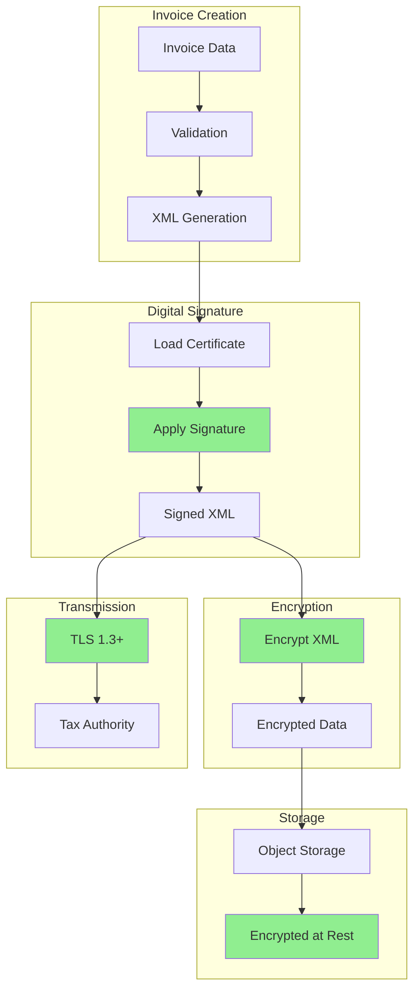

# Data Security Flow

> **Icarus Nova** | Security flow for data encryption, digital signatures, and secure storage.

## Overview

This diagram illustrates the security flow for invoice data, including encryption, digital signatures, and secure storage.

## Security Flow Diagram

## Security Layers

1. **Digital Signature**: XAdES signature on XML
2. **Encryption**: TLS for transmission, encryption at rest
3. **Storage**: Encrypted object storage
4. **Access Control**: Role-based access, audit logging

## Related Documents

- [Digital Signatures](../docs/digital-signatures.md)
- [Security and Compliance](../docs/security-and-compliance.md)

---

**Last Updated:** 2024  
**Maintained by:** Icarus Nova Architecture Team  
**Version:** 1.0
