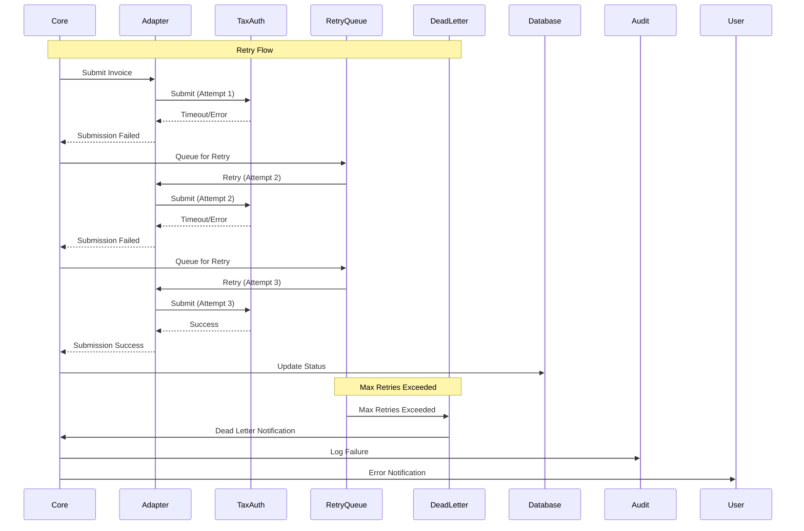

# Failure and Retry Flow

> **Icarus Nova** | Error handling and retry mechanisms for invoice processing.

## Overview

This diagram illustrates how the platform handles failures and implements retry mechanisms for reliable invoice processing.

## Retry Flow Diagram

## Retry Strategy

### Exponential Backoff
- Initial delay: 1 second
- Max delay: 60 seconds
- Backoff multiplier: 2
- Max retries: 5

### Retry Scenarios
- Network failures
- Tax authority timeouts
- Temporary service unavailability
- Rate limiting

### Dead Letter Queue
- Max retries exceeded
- Permanent failures
- Manual intervention required
- Error notification

## Related Documents

- [Invoice Lifecycle](../docs/invoice-lifecycle.md)
- [Invoice Flow](./invoice-flow.md)

---

**Last Updated:** 2024  
**Maintained by:** Icarus Nova Architecture Team  
**Version:** 1.0
