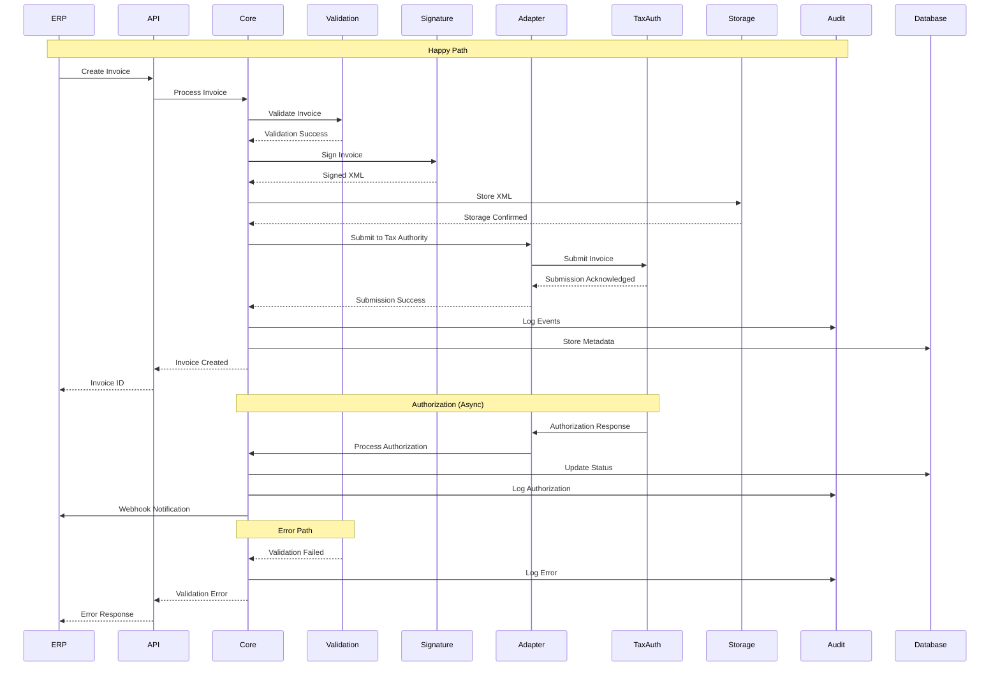

# Invoice Flow Diagram

> **Icarus Nova** | Complete flow of invoice processing from creation to authorization.

## Overview

This diagram illustrates the complete flow of invoice processing, including happy path, error handling, and retry mechanisms.

## Invoice Flow Diagram

## Flow Stages

### 1. Invoice Creation
- ERP/business system sends invoice data
- API Gateway receives and routes
- Core Service creates invoice record

### 2. Validation
- Business rule validation
- Regulatory validation
- Schema validation
- Tax calculation validation

### 3. Digital Signature
- Load certificate
- Apply digital signature
- Validate signature
- Store signed XML

### 4. Storage
- Store signed XML
- Generate PDF (if needed)
- Store in object storage
- Update metadata

### 5. Tax Authority Submission
- Select appropriate adapter
- Transform to tax authority format
- Submit to tax authority
- Receive acknowledgment

### 6. Authorization
- Wait for tax authority response
- Process authorization
- Update invoice status
- Notify users

## Related Documents

- [Invoice Lifecycle](../docs/invoice-lifecycle.md)
- [Failure and Retry Flow](./failure-and-retry-flow.md)

---

**Last Updated:** 2024  
**Maintained by:** Icarus Nova Architecture Team  
**Version:** 1.0
