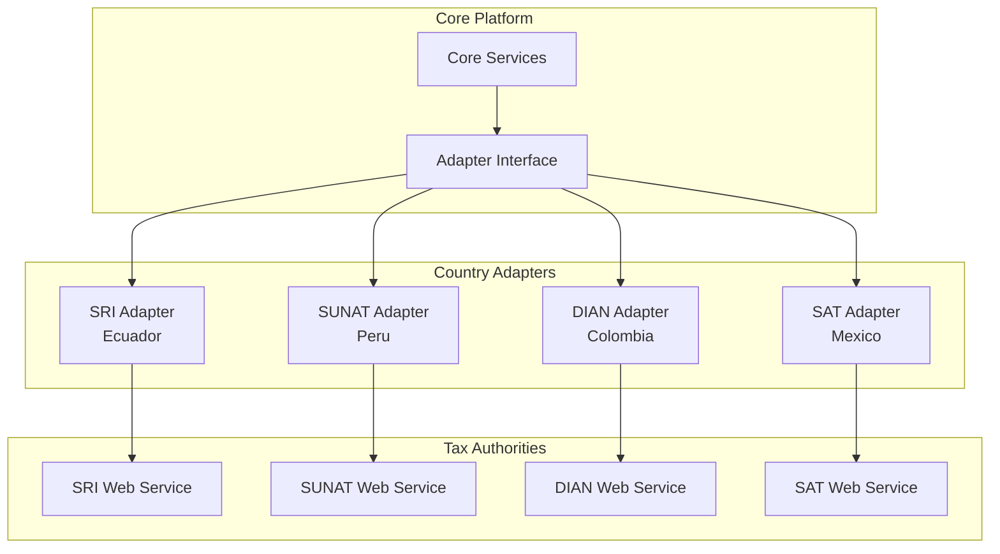

# Tax Authority Integration Diagram

> **Icarus Nova** | Integration patterns with tax authorities across different countries.

## Overview

This diagram shows how the platform integrates with different tax authorities using the adapter pattern.

## Integration Architecture

## Adapter Pattern

### Common Interface
- `submitInvoice(invoice)`
- `checkAuthorization(submissionId)`
- `getAuthorizationDetails(authorizationId)`

### Country-Specific Implementation
- Country-specific web service integration
- Country-specific authentication
- Country-specific response handling

## Related Documents

- [Tax Authority Adapters](../integrations/tax-authority-adapters.md)
- [Multi-Country Strategy](../docs/multi-country-strategy.md)

---

**Last Updated:** 2024  
**Maintained by:** Icarus Nova Architecture Team  
**Version:** 1.0
